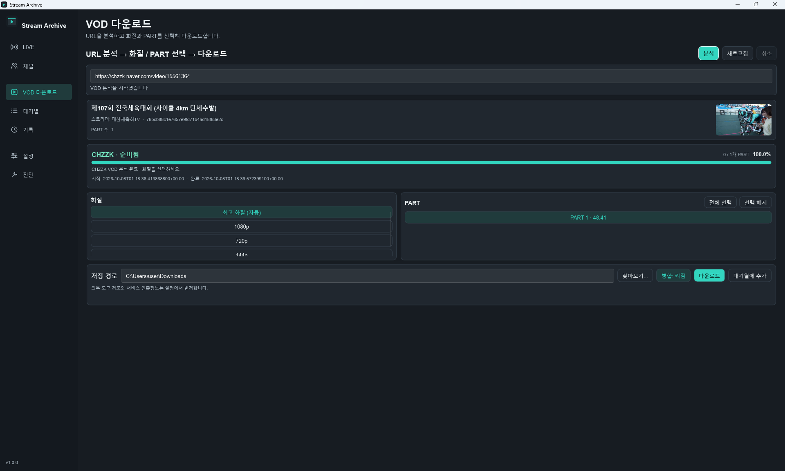

# Stream Archive

**SOOP·CHZZK의 LIVE 자동 녹화와 VOD 다운로드, KICK 공개 LIVE 녹화 및 공개·구독 VOD 다운로드를 관리하는 로컬 아카이브 도구입니다.**

Windows에서는 Slint Native GUI를, Linux/macOS에서는 CLI·headless 실행을 제공합니다. Queue, History, 백업·복구, Diagnostics를 한곳에서 관리할 수 있습니다.

[릴리스 및 다운로드](https://github.com/p1k1g/stream-archive/releases) · [1.0.0 릴리스 노트](docs/RELEASE_NOTES_1_0_0.md) · [운영 가이드](docs/OPERATIONS.md) · [문제 제보](https://github.com/p1k1g/stream-archive/issues)

> **Stream Archive 1.0.0 공개**
>
> [1.0.0 Release](https://github.com/p1k1g/stream-archive/releases/tag/v1.0.0)가 공개됐습니다. Windows/Linux/macOS 패키지와 자동 검증 결과는 [패키지 빌드](https://github.com/p1k1g/stream-archive/actions/runs/37741196303)에서 확인할 수 있습니다. 실제 서비스·GUI·OS별 비밀정보 저장의 수동 검증 상태는 [수동 RC 체크리스트](docs/MANUAL_RC_1_0_0.md)에서 별도로 관리합니다.

## 화면 미리보기

### LIVE

방송 감시·녹화 상태와 저장공간을 확인합니다.


<details>
<summary>채널 관리 · VOD · 대기열 화면 보기</summary>

### 채널

SOOP/CHZZK/KICK 채널을 등록하고 방송 감시 여부와 채널별 저장 폴더를 설정합니다.


### VOD 다운로드

URL 분석 후 제목과 썸네일을 확인하고, 화질·PART·저장 경로를 선택해 다운로드하거나 대기열에 추가합니다.



### 대기열 (Queue)

VOD 다운로드의 대기·진행·완료·실패 상태를 확인합니다.


</details>

위 이미지는 실제 Windows Native 앱의 LIVE 녹화, 채널 관리, CHZZK VOD 분석 및 다운로드 진행 화면입니다. 화면에 표시된 채널·영상은 사용 예시입니다.

## 다운로드 및 지원 환경

[1.0.0 Release 페이지](https://github.com/p1k1g/stream-archive/releases/tag/v1.0.0)와 아래 링크에서 패키지를 다운로드할 수 있습니다. 현재 링크는 공개된 Release 본문의 GitHub 첨부파일 주소를 사용합니다.

| 운영체제 | 다운로드 | 패키지 | 실행 방식 |
|---|---|---|---|
| Windows x64 | [Windows 다운로드](https://github.com/user-attachments/files/33206249/stream-archive-windows-x64.zip) | `stream-archive-windows-x64.zip` | `StreamArchive.exe` / `RUN.bat` |
| Linux x64 | [Linux 다운로드](https://github.com/user-attachments/files/33206260/stream-archive-linux-x64.tar.gz) | `stream-archive-linux-x64.tar.gz` | CLI·headless |
| macOS arm64 | [macOS 다운로드](https://github.com/user-attachments/files/33206269/stream-archive-macos-arm64.tar.gz) | `stream-archive-macos-arm64.tar.gz` | CLI·headless |

현재 공개 Release에는 별도 `.sha256` 파일이 첨부되지 않았습니다. 체크섬 파일은 [패키지 빌드의 Actions artifact](https://github.com/p1k1g/stream-archive/actions/runs/37741196303)에 패키지와 함께 포함되어 있습니다. artifact 다운로드에는 GitHub 로그인이 필요하며 보관 기간이 제한됩니다. 패키지를 실행하기 전에 해당 체크섬을 확인하세요.

패키지 build와 smoke는 각 플랫폼의 CI에서 검증합니다. 실제 서비스 세션, GUI 조작 및 OS별 비밀정보 저장의 최종 수동 검증은 별도로 관리합니다. Linux/macOS에는 GUI를 제공하지 않으며, 검증하지 않은 아키텍처의 지원을 주장하지 않습니다.

**Streamlink, yt-dlp, FFmpeg는 별도로 설치해야 합니다. 공식 패키지에는 포함되지 않습니다.**

## 빠른 시작

### SOOP LIVE 사전 설정 — Cloudflare Worker

SOOP LIVE를 사용하려면 [backend/worker.js](backend/worker.js)를 본인의 Cloudflare Workers에 배포하고 앱에 Worker URL과 API key를 설정해야 합니다. **Worker URL에는 `/soop/url`을 포함**하고, **앱의 Worker API key는 Worker secret `API_SECRET`과 같은 값**을 입력합니다. Cloudflare 계정의 API Token을 입력하는 항목이 아닙니다.

생성·배포·secret 설정과 연결 확인은 [Cloudflare Worker 설정 가이드](docs/CLOUDFLARE_WORKER.md)를 따라 진행하세요. CHZZK/KICK만 사용하는 경우 이 단계는 필요하지 않습니다(SOOP 채널은 비활성화). SOOP VOD 다운로드 경로에도 이 Worker를 사용하지 않습니다.

### Windows

1. [Streamlink](https://streamlink.github.io/install.html), [yt-dlp](https://github.com/yt-dlp/yt-dlp#installation), [FFmpeg](https://ffmpeg.org/download.html)를 준비합니다.
2. 위 Windows 패키지를 다운로드하고, 패키지 빌드의 Actions artifact에서 `.sha256`을 받아 체크섬을 확인한 뒤 새 폴더에 압축을 풉니다.
3. `StreamArchive.exe`를 더블클릭하거나 `RUN.bat`를 실행합니다. Rust 설치나 source build는 필요하지 않습니다.
4. **설정 → 일반**에서 저장 경로와 필요한 서비스 설정을 구성합니다. SOOP LIVE는 위 Worker 사전 설정을 먼저 완료합니다. 외부 도구는 실행 파일 경로를 지정하거나 `PATH`에서 찾을 수 있도록 준비합니다.
5. **진단** 화면에서 도구 탐색·버전 확인 결과를 확인합니다.
6. 채널을 등록해 LIVE 녹화를 시작하거나, VOD URL을 입력해 다운로드합니다.

Explorer에서 직접 실행해도 실행 파일 옆의 `backend\`와 `data\stream-archive.db`를 기본 경로로 사용합니다.

창의 닫기 동작은 설정에 따라 프로그램 종료, 시스템 트레이 이동 또는 선택 확인으로 처리합니다. 트레이로 이동하면 방송 감시·녹화·다운로드를 유지하고, 프로그램을 종료하면 애플리케이션이 소유한 LIVE/VOD 프로세스를 정리합니다. 다운로드 완료·실패 알림은 설정에서 켜거나 끌 수 있습니다.

### Linux / macOS

외부 도구를 설치하고 압축 파일의 `.sha256`을 확인한 뒤 실행합니다. 아래 예시는 Linux이며 macOS는 파일명을 `stream-archive-macos-arm64.tar.gz`로 바꿉니다.

```bash
tar -xzf stream-archive-linux-x64.tar.gz
cd stream-archive

./bin/stream-archive-cli init
./bin/stream-archive-cli tools
./bin/stream-archive-cli tools configure
./bin/stream-archive-cli doctor --active-tools
./bin/stream-archive-cli status --json
```

이후 채널·서비스 설정을 구성하고 foreground watcher를 실행할 수 있습니다.

```bash
./bin/stream-archive-cli serve --watch
```

패키지 root에서 실행하거나 `STREAM_ARCHIVE_BACKEND_DIR` / `STREAM_ARCHIVE_DATA_DIR`를 명시하세요. 종료는 `Ctrl+C`를 사용합니다. 전체 명령과 사용 조건은 [Unix CLI 가이드](docs/UNIX_CLI.md)를 참고하세요.

## 주요 기능 및 지원 범위

| 기능 | SOOP | CHZZK | KICK |
|---|:---:|:---:|:---:|
| LIVE 자동 녹화 | ✅ | ✅ | 공개 LIVE |
| VOD 분석·다운로드 | ✅ | ✅ | 공개 / 구독 VOD (구독 인증 필요) |
| Queue / History | ✅ | ✅ | VOD Queue / LIVE·VOD History |
| 취소·재시도 | ✅ | ✅ | LIVE 중지·재확인 / VOD 취소·새 파일 재시도 (이어받기 미지원) |
| 클립 / CATCH / 쇼츠 / 기타 별도 콘텐츠 | 미지원 | 미지원 | 미지원 |

- Windows Native UI에서 채널·녹화·다운로드 관리
- 저장 경로·품질 설정 및 LIVE 저장공간 확인
- SQLite 기반 설정·Channels·Queue·History 유지
- 자동 백업 정책, Backup / Restore, Diagnostics / Runtime Logs
- Windows DPAPI / Linux Secret Service / macOS Keychain을 통한 비밀정보 보호

지원 대상은 SOOP/CHZZK의 일반 LIVE/VOD, KICK 공개 LIVE 및 공개·구독 VOD입니다. KICK은 채널 URL의 마지막 이름(slug)을 등록합니다. API 차단은 오프라인으로 처리하지 않으며, 최신 Streamlink 및 JS challenge 처리용 Chromium 계열 브라우저가 필요할 수 있습니다. 실제 서비스·계정 환경의 수동 검증은 자동 CI 검증과 별도로 관리합니다. [KICK LIVE 사용 조건과 수동 QA](docs/PHASE26_1_KICK_LIVE.md)를 참고하세요. 클립, CATCH, 쇼츠·짧은 영상, 별도 게시물·커뮤니티 콘텐츠 등은 지원하지 않습니다.

## 기본 사용법

### LIVE 녹화

1. **채널** 화면에서 플랫폼과 채널을 등록하고 저장합니다.
2. 출력 경로와 필요한 인증정보를 설정합니다.
3. **LIVE** 화면에서 방송 감시를 시작합니다.
4. 방송이 시작되면 녹화를 시작하며 상태와 저장공간을 확인할 수 있습니다.
5. 방송 종료·수동 중지·앱 종료 시 애플리케이션이 소유한 녹화 프로세스를 정리합니다.

### VOD 다운로드

1. **VOD** 화면에서 SOOP/CHZZK/KICK VOD URL을 입력하고 분석합니다. KICK 구독 VOD는 설정에 해당 계정의 `session_token`을 저장한 뒤 분석합니다.
2. 품질과 출력 경로 등 필요한 옵션을 선택합니다.
3. 다운로드를 시작하거나 Queue에 등록합니다.
4. **대기열**에서 진행·실패·취소·재시도 상태를 확인합니다.
5. **기록**에서 LIVE/VOD 작업 내역을 확인합니다.

SOOP VOD는 단일·다중 PART 분석과 인증 만료 후 이어받기를 지원합니다. 서비스별 재시도·이어받기 조건은 [이어받기 정책 및 수동 QA](docs/PHASE25_6_VOD_RESUME_THUMBNAILS.md)를 참고하세요.

KICK VOD는 yt-dlp로 4개 조각을 병렬 다운로드하고 MPEG-TS(`.ts`)로 저장합니다. MP4 remux와 이어받기는 하지 않으며, 재시도는 새 파일로 시작합니다. LIVE/VOD 첫 프레임 썸네일에는 FFmpeg가 필요합니다. [KICK VOD 사용 조건 및 수동 검증](docs/PHASE26_2_KICK_VOD.md)을 참고하세요.

새 인증정보를 입력해 저장하면 해당 기존 값이 교체되고, 빈칸은 기존 값을 유지합니다. **CHZZK 인증정보 삭제**는 `NID_AUT`·`NID_SES`를 함께 제거합니다. **SOOP 비밀번호 삭제**는 비밀번호만 제거하며 사용자명·Worker URL·API key는 유지합니다. 삭제 버튼은 즉시 적용되고 브라우저 로그인에는 영향을 주지 않습니다.

KICK 구독 VOD의 `session_token`은 **설정 → 일반**에 입력하고 저장합니다. 입력란을 비운 채 저장하면 기존 인증정보가 유지됩니다. 새 값으로 교체하려면 새 토큰을 입력해 저장하고, 제거하려면 **KICK 인증정보 삭제** 버튼을 사용하세요. 이 버튼은 앱에 저장된 인증정보를 제거하며 브라우저 로그아웃이나 서비스 측 세션 해제를 대신하지 않습니다.

## 데이터·백업·업그레이드

설정, Channels, Queue, History와 백업 정책의 기준 데이터는 `data/stream-archive.db`입니다. `STREAM_ARCHIVE_DATA_DIR`로 데이터 경로를 지정할 수 있습니다.

- **설정 → 백업 / 복원**에서 백업 정책, 백업 생성·무결성 확인·Restore를 관리합니다.
- 기본 백업 폴더는 portable 패키지 밖의 형제 디렉터리 `stream-archive-backups`입니다. `STREAM_ARCHIVE_BACKUP_DIR`로 고정할 수 있습니다.
- Windows 오프라인 백업은 앱을 종료한 뒤 `BACKUP_DATA.bat`를 사용합니다. 복구 명령과 안전 조건은 [운영 가이드](docs/OPERATIONS.md)를 따릅니다.
- 업그레이드 전 정상 종료·백업·무결성 확인을 수행하고 이전 패키지를 보관합니다. 새 패키지는 별도 폴더에 풀고 기존 데이터 경로를 유지합니다.
- 새 버전 실행 후 설정·Channels·Queue·History를 확인하고 재실행 후에도 유지되는지 확인합니다.
- rollback 시 임의 schema downgrade 호환성을 가정하지 않습니다. 실제 DB 상태에서 필요한 경우에만 검증한 업그레이드 전 백업을 복구합니다.

Linux/macOS Restore는 SOOP·CHZZK·KICK·Worker 인증정보와 정리 대기 기록을 현재 상태로 유지합니다. SOOP 사용자명·Worker URL도 현재 값을 유지하며, 다른 설정·채널·기록은 백업에서 복원합니다. 삭제·미설정 인증정보를 옛 백업에서 되살리지 않습니다. Windows DPAPI 복원 방식은 그대로입니다.

Windows는 CurrentUser DPAPI, Linux는 `secret-tool`을 통한 Secret Service, macOS는 Keychain을 사용합니다. Linux에는 사용 가능한 Secret Service 세션이 필요하며, native store가 없을 때 평문 저장으로 자동 fallback하지 않습니다. 다른 PC·OS로 DB만 옮겼을 때 같은 비밀정보를 사용할 수 있다고 가정하지 마세요.

## 알려진 제한사항 및 문제 해결

- 외부 미디어 도구는 별도 설치가 필요합니다. 탐색 실패 시 경로와 `PATH`를 확인한 뒤 Diagnostics를 새로고침하세요.
- 인증이 필요한 콘텐츠에는 유효한 서비스 인증정보가 필요합니다.
- Windows artifact는 Authenticode 서명되지 않았고 macOS artifact는 code signing·notarization을 적용하지 않았습니다.
- MSI, deb/rpm, Homebrew, Snap/Flatpak/AppImage 및 systemd/launchd 설치 기능은 제공하지 않습니다.
- 개인 사용에서 출발한 오픈소스 프로젝트이며 모든 환경·예외 상황의 동작을 보장하지 않습니다. 중요한 설정과 녹화물은 별도로 백업하세요.

문제가 있으면 [GitHub Issues](https://github.com/p1k1g/stream-archive/issues)에 버전, OS, 재현 순서, 실제 결과와 관련 로그를 알려주세요. 비밀번호·cookie·token 등 인증정보는 포함하지 마세요. 보안 취약점은 [보안 제보 안내](SECURITY.md)를 따릅니다.

## 문서 및 개발

| 문서 | 내용 |
|---|---|
| [1.0.0 릴리스 노트](docs/RELEASE_NOTES_1_0_0.md) | 지원 범위·변경사항·제한사항 |
| [운영 가이드](docs/OPERATIONS.md) | 백업·복구·업그레이드·rollback |
| [Cloudflare Worker 설정](docs/CLOUDFLARE_WORKER.md) | SOOP LIVE용 Worker 생성·secret·앱 연결 |
| [Unix CLI 가이드](docs/UNIX_CLI.md) | Linux/macOS 명령 및 운영 조건 |
| [개발 및 빌드](docs/DEVELOPMENT.md) | Rust/Slint 구조·source build·CI |
| [개발 이력 및 로드맵](docs/ROADMAP.md) | Phase별 작업 이력·공개 준비 상태 |
| [기여 안내](CONTRIBUTING.md) | 개발 참여 및 PR 작성 |

Windows Slint UI와 Unix CLI·headless는 공통 `StreamArchiveCore`를 사용합니다. 개발 과정에서 AI-assisted development를 활용하며 자동 테스트와 실제 환경 검증을 병행합니다. 상세 내부 구조와 완료한 Phase 이력은 위 개발 문서로 분리했습니다.

## 프로젝트 안내 및 라이선스

Stream Archive는 독립적인 오픈소스 프로젝트이며 SOOP, NAVER, CHZZK, KICK, Streamlink, FFmpeg, yt-dlp와 제휴·승인·후원 관계가 없습니다. 명칭과 상표는 해당 권리자에게 귀속됩니다.

사용자는 적용되는 법률·저작권 규정·각 서비스 이용약관을 준수해야 합니다. 이 프로젝트는 콘텐츠 이용 권한이나 서비스 접근 제한을 우회할 권리를 부여하지 않습니다.

코드는 **GNU Affero General Public License v3.0 or later (`AGPL-3.0-or-later`)**로 공개합니다. [LICENSE](LICENSE)를 참고하세요. 외부 도구는 각각의 라이선스를 따르며 자세한 내용은 [THIRD_PARTY_NOTICES.md](THIRD_PARTY_NOTICES.md)에 있습니다.
