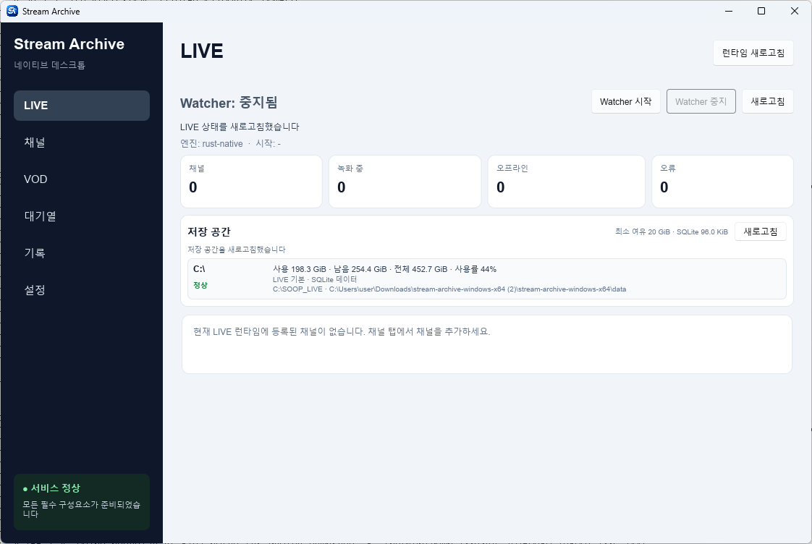
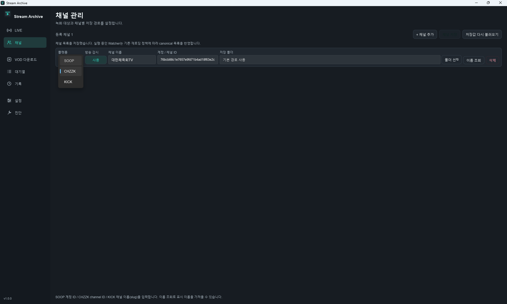
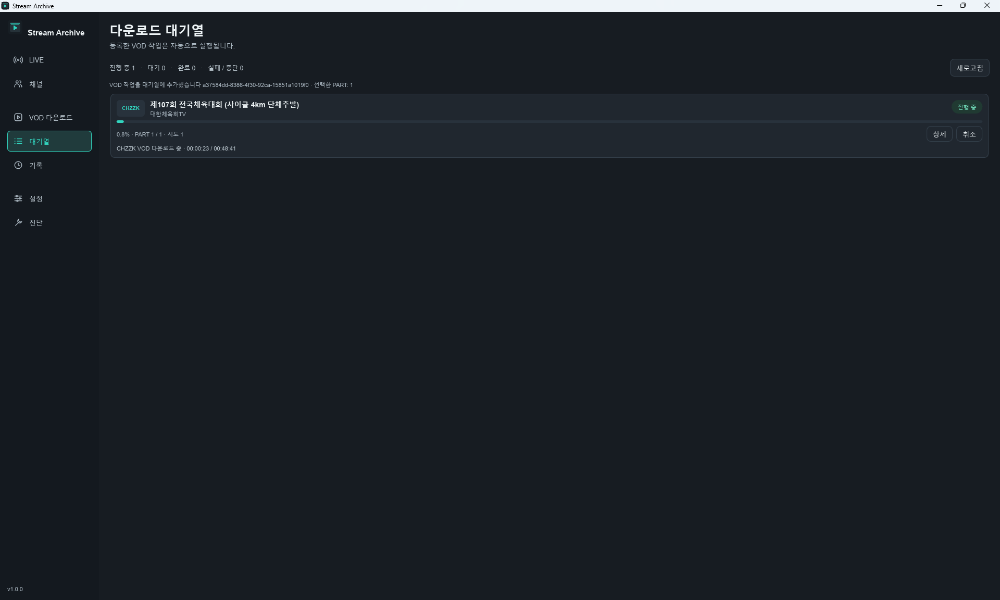

# Stream Archive

**SOOP과 CHZZK의 LIVE 자동 녹화와 VOD 다운로드를 관리하는 로컬 아카이브 도구입니다.**

Windows에서는 Slint Native GUI를, Linux/macOS에서는 CLI·headless 실행을 제공합니다. Queue, History, 백업·복구, Diagnostics를 한곳에서 관리할 수 있습니다.

[릴리스 및 다운로드](https://github.com/p1k1g/stream-archive/releases) · [1.0.0 릴리스 노트](docs/RELEASE_NOTES_1_0_0.md) · [운영 가이드](docs/OPERATIONS.md) · [문제 제보](https://github.com/p1k1g/stream-archive/issues)

> **1.0.0 공개 준비 중**
>
> 첫 공개 안정 버전을 준비하고 있습니다. 아직 `v1.0.0` GitHub Release는 공개하지 않았습니다. 최종 수동 검증 및 공개 승인은 [릴리스 마무리 절차](docs/PHASE23_12_1_0_0_RELEASE_CLOSURE.md)와 [수동 RC 체크리스트](docs/MANUAL_RC_1_0_0.md)에서 관리합니다.

## 화면 미리보기

### LIVE

방송 감시·녹화 상태와 저장공간을 확인합니다.



<details>
<summary>채널 및 대기열 화면 보기</summary>

### 채널

SOOP/CHZZK 녹화 채널을 등록하고 관리합니다.



### 대기열 (Queue)

VOD 다운로드의 대기·진행·완료·실패 상태를 확인합니다.



</details>

위 이미지는 채널과 작업이 등록되지 않은 초기 화면 예시입니다.

## 다운로드 및 지원 환경

1.0.0 공개 후 [GitHub Releases](https://github.com/p1k1g/stream-archive/releases)에서 다음 파일을 받으세요. 현재 표는 공개 예정 패키지 안내이며 다운로드 가능한 Release가 있다는 의미는 아닙니다.

| 운영체제 | 패키지 | 실행 방식 |
|---|---|---|
| Windows x64 | `stream-archive-windows-x64.zip` | `StreamArchive.exe` / `RUN.bat` |
| Linux x64 | `stream-archive-linux-x64.tar.gz` | CLI·headless |
| macOS arm64 | `stream-archive-macos-arm64.tar.gz` | CLI·headless |

패키지 build와 smoke는 각 플랫폼의 CI에서 검증합니다. 실제 서비스 세션, GUI 조작 및 OS별 비밀정보 저장의 최종 수동 검증은 별도로 관리합니다. Linux/macOS에는 GUI를 제공하지 않으며, 검증하지 않은 아키텍처의 지원을 주장하지 않습니다.

**Streamlink, yt-dlp, FFmpeg는 별도로 설치해야 합니다. 공식 패키지에는 포함되지 않습니다.**

## 빠른 시작

### SOOP LIVE 사전 설정 — Cloudflare Worker

SOOP LIVE를 사용하려면 [backend/worker.js](backend/worker.js)를 본인의 Cloudflare Workers에 배포하고 앱에 Worker URL과 API key를 설정해야 합니다. **Worker URL에는 `/soop/url`을 포함**하고, **앱의 Worker API key는 Worker secret `API_SECRET`과 같은 값**을 입력합니다. Cloudflare 계정의 API Token을 입력하는 항목이 아닙니다.

생성·배포·secret 설정과 연결 확인은 [Cloudflare Worker 설정 가이드](docs/CLOUDFLARE_WORKER.md)를 따라 진행하세요. CHZZK만 사용하는 경우 이 단계는 필요하지 않습니다(SOOP 채널은 비활성화). SOOP VOD 다운로드 경로에도 이 Worker를 사용하지 않습니다.

### Windows

1. [Streamlink](https://streamlink.github.io/install.html), [yt-dlp](https://github.com/yt-dlp/yt-dlp#installation), [FFmpeg](https://ffmpeg.org/download.html)를 준비합니다.
2. 공개된 Windows ZIP과 함께 제공되는 `.sha256`을 확인한 뒤 새 폴더에 압축을 풉니다.
3. `StreamArchive.exe`를 더블클릭하거나 `RUN.bat`를 실행합니다. Rust 설치나 source build는 필요하지 않습니다.
4. **설정 → 일반**에서 저장 경로와 필요한 서비스 설정을 구성합니다. SOOP LIVE는 위 Worker 사전 설정을 먼저 완료합니다. 외부 도구는 실행 파일 경로를 지정하거나 `PATH`에서 찾을 수 있도록 준비합니다.
5. **설정 → 관리**의 Diagnostics에서 도구 탐색·버전 확인 결과를 확인합니다.
6. 채널을 등록해 LIVE 녹화를 시작하거나, VOD URL을 입력해 다운로드합니다.

Explorer에서 직접 실행해도 실행 파일 옆의 `backend\`와 `data\stream-archive.db`를 기본 경로로 사용합니다.

창을 정상 종료하면 애플리케이션이 소유한 LIVE/VOD 프로세스를 정리합니다. 계속 녹화하려면 애플리케이션을 실행한 상태로 유지하세요.

### Linux / macOS

외부 도구를 설치하고 압축 파일의 `.sha256`을 확인한 뒤 실행합니다. 아래 예시는 Linux이며 macOS는 파일명을 `stream-archive-macos-arm64.tar.gz`로 바꿉니다.

```bash
tar -xzf stream-archive-linux-x64.tar.gz
cd stream-archive

./bin/stream-archive-cli init
./bin/stream-archive-cli tools
./bin/stream-archive-cli tools configure
./bin/stream-archive-cli doctor --active-tools
./bin/stream-archive-cli status --json
```

이후 채널·서비스 설정을 구성하고 foreground watcher를 실행할 수 있습니다.

```bash
./bin/stream-archive-cli serve --watch
```

패키지 root에서 실행하거나 `STREAM_ARCHIVE_BACKEND_DIR` / `STREAM_ARCHIVE_DATA_DIR`를 명시하세요. 종료는 `Ctrl+C`를 사용합니다. 전체 명령과 사용 조건은 [Unix CLI 가이드](docs/UNIX_CLI.md)를 참고하세요.

## 주요 기능 및 지원 범위

| 기능 | SOOP | CHZZK |
|---|:---:|:---:|
| LIVE 자동 녹화 | ✅ | ✅ |
| VOD 분석·다운로드 | ✅ | ✅ |
| Queue / History | ✅ | ✅ |
| 취소·재시도 | ✅ | ✅ |
| 클립 / CATCH / 쇼츠 / 기타 별도 콘텐츠 | 미지원 | 미지원 |

- Windows Native UI에서 채널·녹화·다운로드 관리
- 저장 경로·품질 설정 및 LIVE 저장공간 확인
- SQLite 기반 설정·Channels·Queue·History 유지
- 자동 백업 정책, Backup / Restore, Diagnostics / Runtime Logs
- Windows DPAPI / Linux Secret Service / macOS Keychain을 통한 비밀정보 보호

지원 대상은 SOOP/CHZZK의 일반 LIVE/VOD입니다. 클립, CATCH, 쇼츠·짧은 영상, 별도 게시물·커뮤니티 콘텐츠 등은 지원하지 않습니다.

## 기본 사용법

### LIVE 녹화

1. **채널** 화면에서 플랫폼과 채널을 등록하고 저장합니다.
2. 출력 경로와 필요한 인증정보를 설정합니다.
3. **LIVE** 화면에서 Watcher를 시작합니다.
4. 방송이 시작되면 녹화를 시작하며 상태와 저장공간을 확인할 수 있습니다.
5. 방송 종료·수동 중지·앱 종료 시 애플리케이션이 소유한 녹화 프로세스를 정리합니다.

### VOD 다운로드

1. **VOD** 화면에서 SOOP/CHZZK VOD URL을 입력하고 분석합니다.
2. 품질과 출력 경로 등 필요한 옵션을 선택합니다.
3. 다운로드를 시작하거나 Queue에 등록합니다.
4. **대기열**에서 진행·실패·취소·재시도 상태를 확인합니다.
5. **기록**에서 LIVE/VOD 작업 내역을 확인합니다.

## 데이터·백업·업그레이드

설정, Channels, Queue, History와 백업 정책의 기준 데이터는 `data/stream-archive.db`입니다. `STREAM_ARCHIVE_DATA_DIR`로 데이터 경로를 지정할 수 있습니다.

- **설정 → 관리**에서 백업 정책, 백업 생성·무결성 확인·Restore를 관리합니다.
- 기본 백업 폴더는 portable 패키지 밖의 형제 디렉터리 `stream-archive-backups`입니다. `STREAM_ARCHIVE_BACKUP_DIR`로 고정할 수 있습니다.
- Windows 오프라인 백업은 앱을 종료한 뒤 `BACKUP_DATA.bat`를 사용합니다. 복구 명령과 안전 조건은 [운영 가이드](docs/OPERATIONS.md)를 따릅니다.
- 업그레이드 전 정상 종료·백업·무결성 확인을 수행하고 이전 패키지를 보관합니다. 새 패키지는 별도 폴더에 풀고 기존 데이터 경로를 유지합니다.
- 새 버전 실행 후 설정·Channels·Queue·History를 확인하고 재실행 후에도 유지되는지 확인합니다.
- rollback 시 임의 schema downgrade 호환성을 가정하지 않습니다. 실제 DB 상태에서 필요한 경우에만 검증한 업그레이드 전 백업을 복구합니다.

Windows는 CurrentUser DPAPI, Linux는 `secret-tool`을 통한 Secret Service, macOS는 Keychain을 사용합니다. Linux에는 사용 가능한 Secret Service 세션이 필요하며, native store가 없을 때 평문 저장으로 자동 fallback하지 않습니다. 다른 PC·OS로 DB만 옮겼을 때 같은 비밀정보를 사용할 수 있다고 가정하지 마세요.

## 알려진 제한사항 및 문제 해결

- 외부 미디어 도구는 별도 설치가 필요합니다. 탐색 실패 시 경로와 `PATH`를 확인한 뒤 Diagnostics를 새로고침하세요.
- 인증이 필요한 콘텐츠에는 유효한 서비스 인증정보가 필요합니다.
- Windows artifact는 Authenticode 서명되지 않았고 macOS artifact는 code signing·notarization을 적용하지 않았습니다.
- MSI, deb/rpm, Homebrew, Snap/Flatpak/AppImage 및 systemd/launchd 설치 기능은 제공하지 않습니다.
- 개인 사용에서 출발한 오픈소스 프로젝트이며 모든 환경·예외 상황의 동작을 보장하지 않습니다. 중요한 설정과 녹화물은 별도로 백업하세요.

문제가 있으면 [GitHub Issues](https://github.com/p1k1g/stream-archive/issues)에 버전, OS, 재현 순서, 실제 결과와 관련 로그를 알려주세요. 비밀번호·cookie·token 등 인증정보는 포함하지 마세요. 보안 취약점은 [보안 제보 안내](SECURITY.md)를 따릅니다.

## 문서 및 개발

| 문서 | 내용 |
|---|---|
| [1.0.0 릴리스 노트](docs/RELEASE_NOTES_1_0_0.md) | 지원 범위·변경사항·제한사항 |
| [운영 가이드](docs/OPERATIONS.md) | 백업·복구·업그레이드·rollback |
| [Cloudflare Worker 설정](docs/CLOUDFLARE_WORKER.md) | SOOP LIVE용 Worker 생성·secret·앱 연결 |
| [Unix CLI 가이드](docs/UNIX_CLI.md) | Linux/macOS 명령 및 운영 조건 |
| [개발 및 빌드](docs/DEVELOPMENT.md) | Rust/Slint 구조·source build·CI |
| [개발 이력 및 로드맵](docs/ROADMAP.md) | Phase별 작업 이력·공개 준비 상태 |
| [기여 안내](CONTRIBUTING.md) | 개발 참여 및 PR 작성 |

Windows Slint UI와 Unix CLI·headless는 공통 `StreamArchiveCore`를 사용합니다. 개발 과정에서 AI-assisted development를 활용하며 자동 테스트와 실제 환경 검증을 병행합니다. 상세 내부 구조와 완료한 Phase 이력은 위 개발 문서로 분리했습니다.

## 프로젝트 안내 및 라이선스

Stream Archive는 독립적인 오픈소스 프로젝트이며 SOOP, NAVER, CHZZK, Streamlink, FFmpeg, yt-dlp와 제휴·승인·후원 관계가 없습니다. 명칭과 상표는 해당 권리자에게 귀속됩니다.

사용자는 적용되는 법률·저작권 규정·각 서비스 이용약관을 준수해야 합니다. 이 프로젝트는 콘텐츠 이용 권한이나 서비스 접근 제한을 우회할 권리를 부여하지 않습니다.

코드는 **GNU Affero General Public License v3.0 or later (`AGPL-3.0-or-later`)**로 공개합니다. [LICENSE](LICENSE)를 참고하세요. 외부 도구는 각각의 라이선스를 따르며 자세한 내용은 [THIRD_PARTY_NOTICES.md](THIRD_PARTY_NOTICES.md)에 있습니다.

### Windows 시스템 트레이 및 다운로드 알림

Phase 24.1에서 닫기 버튼의 프로그램 종료 / 시스템 트레이 이동 선택을 추가했습니다. 기본값은 프로그램 종료이며, 트레이 이동 시 녹화·다운로드·채널 감시를 유지합니다. [사용 방법 및 수동 검증](docs/PHASE24_1_WINDOWS_TRAY.md)을 참고하세요.

Phase 24.2에서 Windows 다운로드 완료·실패 알림을 추가했습니다. 설정에서 끌 수 있으며, 연속 결과는 묶어서 표시합니다. portable 실행 중의 native 트레이 알림으로 알림 센터 지속 보관이나 앱 종료 후 클릭은 보장하지 않습니다. [알림 정책 및 수동 검증](docs/PHASE24_2_WINDOWS_NOTIFICATIONS.md)을 참고하세요. 실제 환경의 수동 검증과 공개 릴리스 포함 여부는 별도로 확인합니다.

### Windows UI/UX 정리

Phase 25에서 dark theme·mint accent와 화면별 정보 구성을 정리하고 있습니다. LIVE의 방송 감시 버튼 통합, 복수 저장 볼륨 표시, Queue 진행 목록과 별도 Diagnostics 메뉴가 포함됩니다. 기존 기능과 공유 Rust runtime은 유지합니다. [구현 범위 및 수동 QA](docs/PHASE25_UI_UX_REFRESH.md)를 참고하세요. 현재 README screenshot은 Phase 25 이전 UI입니다.
